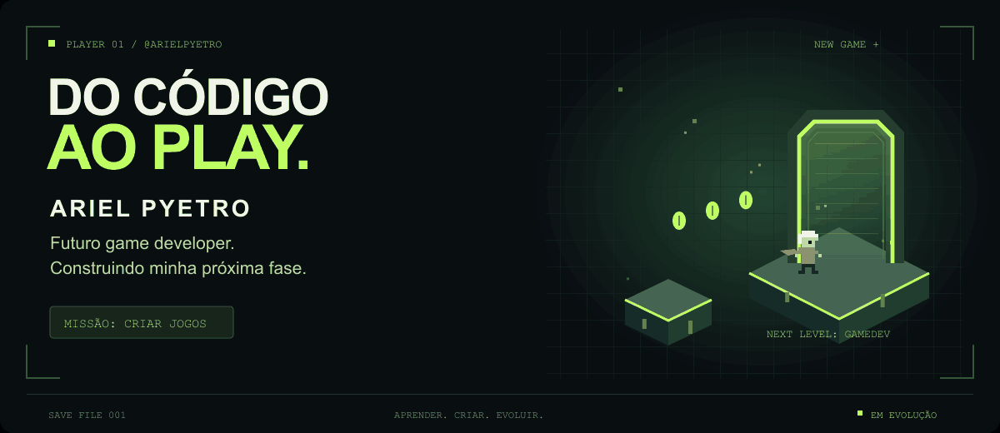

<p align="center">
  
</p>

<h1 align="center">Minha próxima fase: criar jogos. 🎮</h1>

<p align="center">
  Sou <strong>Ariel Pyetro</strong>. Quero transformar ideias em mundos que alguém possa explorar.<br />
  Minha bagagem está no código. Meu próximo objetivo está no <strong>game development</strong>.
</p>

<p align="center">
  <a href="https://github.com/arielpyetro?tab=repositories"><strong>EXPLORAR REPOSITÓRIOS ↗</strong></a>
  &nbsp; · &nbsp;
  <a href="#-missão-principal">MINHA MISSÃO ↓</a>
</p>

<br />

## 🎒 Inventário de habilidades

Estas são as tecnologias que fazem parte da minha jornada até aqui.

<p align="center">
  
  
  
  
  <br />
  
  
  
  
</p>

<br />

## 🕹️ Missão principal

**Me tornar um desenvolvedor de jogos.** Quero levar o que sei de programação para a criação de experiências interativas, com mecânicas interessantes e identidade própria.

- **Explorar** como ideias se transformam em mecânicas de jogo.
- **Praticar** com pequenos protótipos e desafios de programação.
- **Evoluir** um projeto, uma descoberta e uma fase de cada vez.

<br />

<details>
  <summary><strong>📂 Abrir meu save</strong></summary>
  <br />

```text
PLAYER     Ariel Pyetro
USERNAME   @arielpyetro
CLASS      Futuro game developer
QUEST      Transformar código em experiências jogáveis
INVENTORY  HTML · CSS · React · Java · C · C# · JavaScript · Tailwind CSS
STATUS     Próxima fase em construção
```

</details>

<br />

---

<p align="center">
  <strong>Todo grande jogo começa com uma primeira linha de código.</strong><br />
  <sub>CONTINUE? &nbsp; ▸ YES</sub>
</p>
