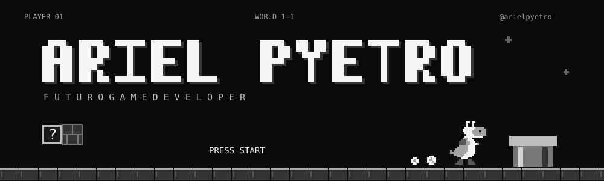
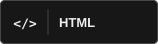
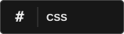
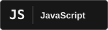
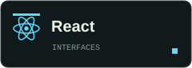
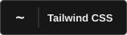
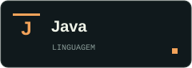
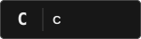
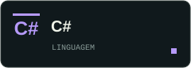

# Olá, eu sou o Ariel.

## Sobre mim

- Quero me tornar um **desenvolvedor de jogos**.
- Gosto da ideia de transformar código em mundos, mecânicas e experiências jogáveis.
- Minha próxima fase é explorar o **game development** e construir meus primeiros jogos.

## Tecnologias

**Web &amp; interfaces**

  
  
  
  
  

**Outras linguagens**

  
  
  

## Yoshi &amp; minhas contribuições

Um quadradinho de cada vez. Um jogo de cada vez.

  <a href="https://github.com/arielpyetro?tab=repositories"><strong>↓ EXPLORE MEUS REPOSITÓRIOS ↓</strong></a>

